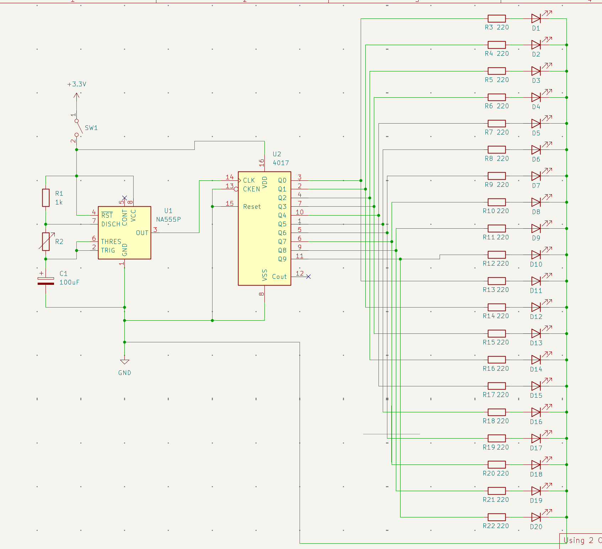

# LED Heart Sequential

This circuit drives a sequential LED display (arranged in a heart shape) using a NE555 timer in astable mode paired with a CD4017 decade counter.
### NE555 – Astable Oscillator
The NA555P is configured in astable mode, generating a continuous square wave clock signal. In this mode, the output continuously toggles between HIGH and LOW with no stable state, requiring no external trigger.
The timing network consists of:

- R1 (1kΩ) — charge resistor (between VCC and DISCH)
- R2 — discharge resistor (between DISCH and TRIG/THRES)
- C1 (100µF) — timing capacitor

The capacitor charges through R1 + R2 and discharges through R2 only, which sets the frequency and duty cycle:

```math
 f = 1.44 / (R_1 + 2R_2)*C_1

 D = R_1 + R_2 / R_1 + 2R_2 * 100%

```

The output (pin 3) feeds directly into the CLK pin (pin 14) of the CD4017.

### CD4017 – Decade Counter / Sequencer
The CD4017 is a Johnson decade counter with 10 decoded outputs (Q0–Q9). On each rising edge of the clock signal received from the 555, it activates the next output in sequence — only one output is HIGH at any given time.

CKEN (pin 13) is tied LOW → counter is always enabled
Reset (pin 15) is tied LOW → the counter cycles freely from Q0 back to Q0 after Q9
Cout (pin 12) is left unconnected (marked with ×)

Each output Q0–Q9 drives two LEDs in parallel through individual 220Ω current-limiting resistors (R3–R22), for a total of 20 LEDs (D1–D20).
### Overall Effect
The result is a chasing / sequential light animation: LEDs light up two at a time in order, cycling continuously around the heart shape. The speed of the animation is set by the 555 oscillator frequency — adjusting R2 speeds up or slows down the chase effect.
Power is supplied at +3.3V and the circuit can be enabled/disabled via SW1

## Main Components
- NE555 timer
- CD4017BE

## Repository Structure
- `project.kicad_sch` — schematic
- `project.kicad_pcb` — PCB layout
- `gerbers/` — production files
- `bom.csv` — bill of materials

## Requirements
- KiCad 9.0.7

## Status
Work in progress

# Schematic
